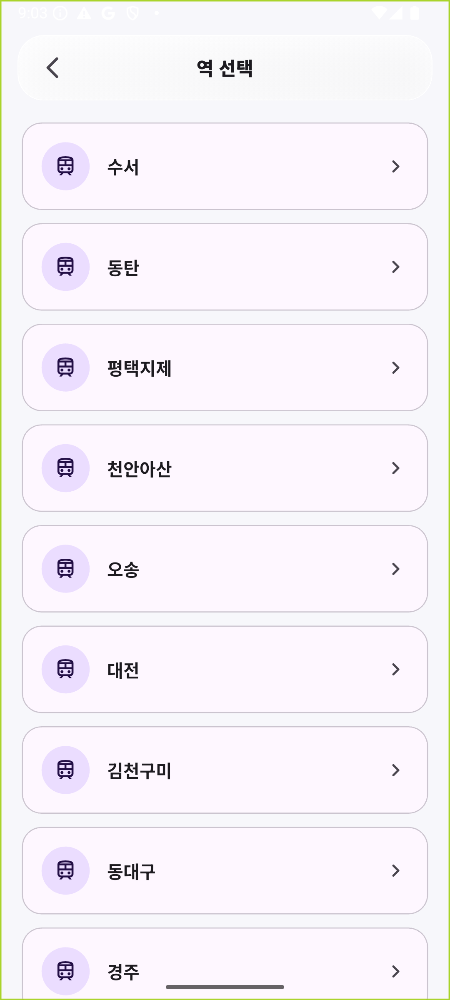
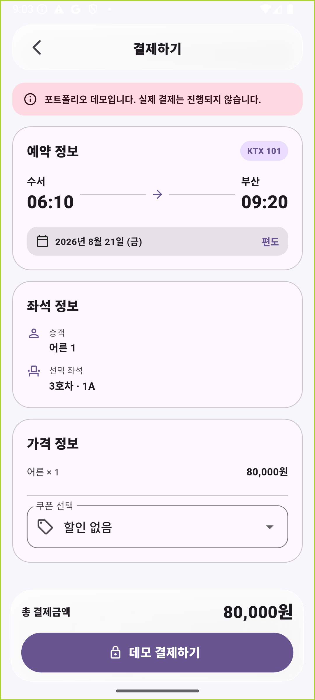
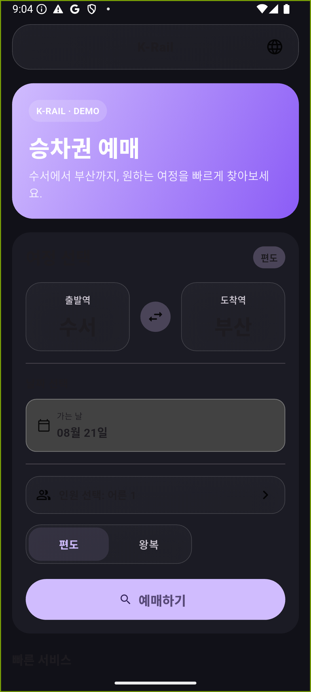

# K-Rail v2 · Train Booking Demo

> **2024 → 2026 UX renewal** · [`v1` original portfolio version](https://github.com/oosuhada/train_booking_app/tree/v1) · [`main` v2 renewal](https://github.com/oosuhada/train_booking_app)

This is a 2026 UX renewal of the Flutter booking app I originally built while learning feature implementation. The booking logic stays intentionally small and deterministic; the renewal focuses on **interaction hierarchy, adaptive controls, motion/accessibility fallback, platform conventions, and rendering-cost-aware translucency**.

기능 구현을 배우며 만들었던 초기 Flutter 철도 예매 앱을 2026년에 다시 설계한 v2입니다. 예약 로직을 불필요하게 확장하는 대신 **정보와 조작 영역의 위계, adaptive control, motion/accessibility fallback, platform convention, blur 렌더링 비용**을 중심으로 제품 UX를 다듬었습니다.

## v1 → v2 / 성장 과정

| | v1 · 2024 | v2 · 2026 |
| --- | --- | --- |
| Focus / 초점 | Booking flow implementation | End-to-end booking UX renewal |
| Route controls | Standard Material surfaces | Floating adaptive glass station/passenger controls |
| Trip type | Choice chips | Selected-state-aware glass segmented control |
| Navigation | Standard AppBar | Compact floating glass toolbar |
| Seat/payment action | Opaque bottom bars | Glass bottom action layer with solid transactional content |
| Accessibility | Material defaults | High-contrast opaque fallback, reduced-motion support, semantics, large tap targets |
| Rendering | Styling-first | Blur limited to compact controls; schedule/seat/payment content stays solid |

### Overview / 프로젝트 소개

한국 철도 예매 경험을 모바일 환경에서 구현한 Flutter 포트폴리오 데모입니다. 출발지/도착지 선택부터 KTX 시간표 조회, 좌석 선택, 예약 확인까지 하나의 흐름으로 구성했습니다.

A Flutter portfolio demo that recreates a Korean train-booking journey, from route selection and KTX schedules to seat selection and booking confirmation.

### Demo Journey / 대표 데모 여정

대표 데모 여정은 **수서 → 부산 / 편도 / 성인 1명**입니다.

The representative demo journey is **Suseo → Busan / one-way / one adult**.

## Preview / 미리보기

<p align="center">
  
  
</p>
<p align="center">
  
  
</p>
<p align="center">
  
  
</p>
<p align="center">
  
</p>

<p align="center"><strong>07 · Dark mode / 다크 모드</strong></p>

위 이미지는 **Android Emulator (API 35, 1080×2400)** 에서 실제 Flutter 앱을 실행해 캡처했습니다. 홈 → 역 선택 → 시간표 → 좌석 선택 → 결제 전 예약 확인 → 예약 완료의 동일한 사용자 흐름을 보여주며 Flutter Web 렌더링이나 디자인 목업이 아닙니다.

These screenshots were captured from the running Flutter app on an **Android Emulator (API 35, 1080×2400)**. They show the same home → station selection → schedule → seat selection → booking review → confirmation journey and are not Flutter Web renders or design mockups.

## What it does / 주요 기능

- 출발역과 도착역 선택 / Select departure and arrival stations.
- 여행 날짜, 승객 수, 편도·왕복 선택 / Choose travel date, passenger count, and one-way or round-trip travel.
- 출발·도착 시각, 소요 시간, 가격, 잔여석을 포함한 KTX 시간표 조회 / Browse KTX schedule cards with times, duration, fare, and remaining seats.
- 선택 가능·선택됨·선택 불가 상태를 구분한 좌석 배치도 / Select seats from an interactive carriage grid with available, selected, and unavailable states.
- 여정, 승객, 좌석, 쿠폰, 결제 금액 확인 / Review itinerary, passenger, seat, coupon, and price information.
- 실제 결제 없이 데모 예약 완료 화면 제공 / Complete a simulated checkout and view booking confirmation details.
- 한국어, 영어, 일본어, 중국어 UI 지원 / Switch between Korean, English, Japanese, and Chinese UI strings.

## Architecture / 구조

- Flutter `StatefulWidget`과 기본 Navigator route를 이용한 화면 흐름 / Screen flow built with Flutter `StatefulWidget` and standard Navigator routes.
- 홈 → 시간표 → 좌석 → 결제/예약 확인 단계로 예약 데이터 전달 / Booking data is passed through the home → schedule → seat → payment/confirmation flow.
- Flutter localization delegate와 `AppLocalizations` 기반 다국어 처리 / Localization is handled with Flutter localization delegates and the app's `AppLocalizations` implementation.
- 시간표, 좌석 상태, 가격, 결제 동작은 로컬 데모 데이터이며 실제 백엔드나 결제 게이트웨이는 사용하지 않음 / Schedule, seat availability, pricing, and checkout behavior use local demo data with no production backend or payment gateway.

### v2 control layer / v2 컨트롤 레이어

`lib/v2/v2_glass.dart` keeps the visual renderer behind a small reusable contract: `V2GlassTheme`, `AppGlassSurface`, `AppGlassToolbar`, `AppGlassSegmentedControl`, and `AppGlassBottomBar`.

`lib/v2/v2_glass.dart`에 공통 renderer를 분리해 화면에서는 동일한 `AppGlass*` contract만 사용합니다. 향후 native material이나 shader renderer로 바꾸더라도 예약 화면의 제품 로직을 크게 수정하지 않아도 되는 경계를 의도했습니다.

- **Content stays content / 콘텐츠는 solid 유지** — journey hero, train cards, seat map, fare breakdown, ticket/confirmation card는 blur 처리하지 않습니다.
- **Controls float / 조작부만 glass** — station/passenger selection, trip segmented control, toolbar, seat/payment bottom actions에만 선택적으로 translucency를 사용합니다.
- **High contrast / 고대비** — `MediaQuery.highContrast`에서는 blur를 제거하고 opacity를 높입니다.
- **Reduced motion / 모션 감소** — `MediaQuery.disableAnimations`에서는 segmented-control animation duration을 0으로 줄입니다.
- **Performance / 성능** — list item·좌석마다 `BackdropFilter`를 만들지 않고 작은 control surface로 blur 영역을 제한합니다.
- **Dark mode / 다크 모드** — 같은 control contract에서 dark surface/tint/shadow 값을 별도로 사용합니다.

## Tech Stack / 기술 스택

- Flutter / Dart
- Material 3
- `flutter_localizations`
- `intl`
- Android Emulator — 디바이스 검증 및 포트폴리오 캡처 / device validation and portfolio captures

## Run / 실행

```bash
git clone https://github.com/oosuhada/train_booking_app.git
cd train_booking_app
flutter pub get
flutter run
```

현재 데모 실행에는 API key, Firebase 프로젝트 또는 별도 credential이 필요하지 않습니다.

No API key, Firebase project, or private credential is required for the current demo flow.

## Demo Note / 데모 안내

이 저장소의 K-Rail은 포트폴리오 데모이며 실제 철도 예약 또는 결제 서비스와 연결되어 있지 않습니다. 시간표, 좌석, 요금, 쿠폰, 예약 정보는 시연 목적의 데이터입니다.

K-Rail in this repository is a portfolio demo and is not connected to an actual railway reservation or payment service. Schedule, seat, fare, coupon, and reservation information are illustrative.
