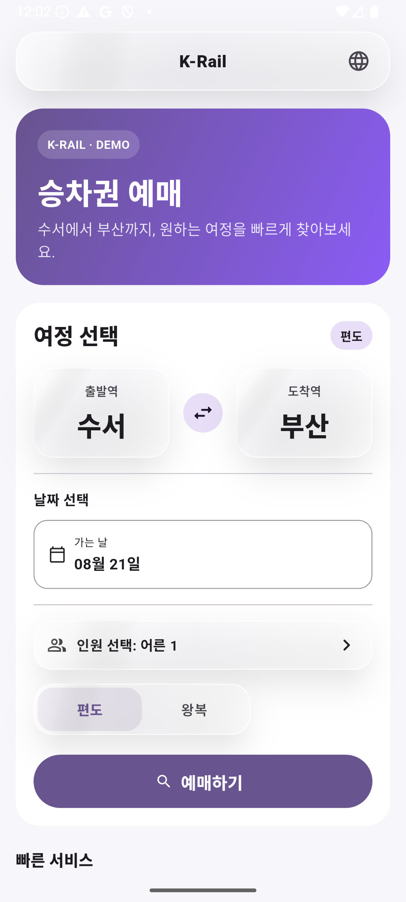
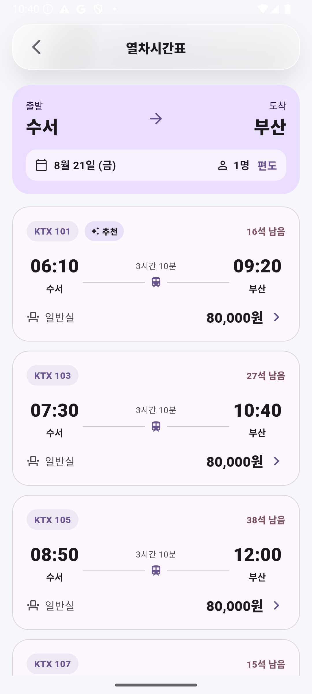
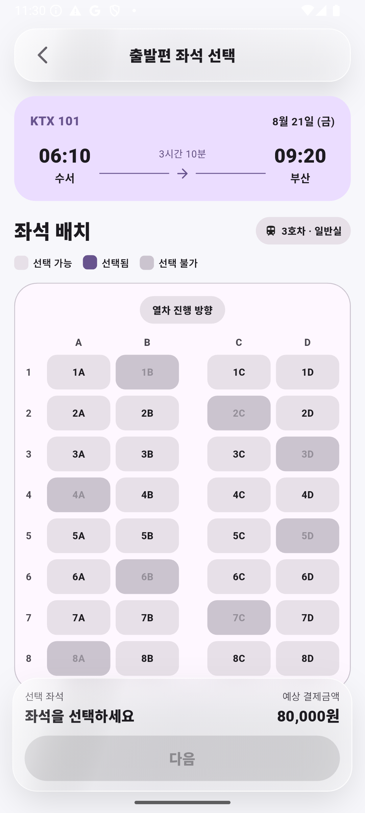
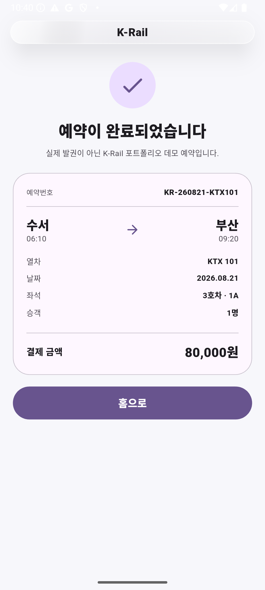

# K-Rail Train Booking Demo

A Flutter mobile demo for a Korean train-booking journey. It focuses on a clear end-to-end flow from route search to KTX schedule selection, seat selection, and a simulated booking confirmation.

The representative demo journey is **Suseo → Busan**, one-way, for one adult.

## Preview

<p align="center">
  
  
</p>
<p align="center">
  
  
</p>

These screenshots were captured from the running app on an **Android Emulator (API 35, 1080×2400)**. They show the same booking flow from home through confirmation and are not Flutter Web renders or design mockups.

## What it does

- Select departure and arrival stations.
- Choose travel date, passenger count, and one-way or round-trip travel.
- Browse product-style KTX schedule cards with times, duration, price, and remaining seats.
- Select seats from an interactive carriage grid with available, selected, and unavailable states.
- Review itinerary, passenger, seat, coupon, and price information before a simulated checkout.
- Show an in-app booking confirmation with reservation details.
- Switch between Korean, English, Japanese, and Chinese UI strings.

## Architecture

- Flutter `StatefulWidget`-based screen flow using standard Navigator routes.
- Booking data is passed through the home → schedule → seat → payment/confirmation flow.
- Localization is handled with Flutter localization delegates and the app's `AppLocalizations` implementation.
- Schedule, seat availability, pricing, and checkout behavior are local demo data; there is no production backend or payment gateway.

## Tech Stack

- Flutter / Dart
- Material 3
- `flutter_localizations`
- `intl`
- Android Emulator for device validation and portfolio captures

## Run

```bash
git clone https://github.com/oosuhada/train_booking_app.git
cd train_booking_app
flutter pub get
flutter run
```

No API key, Firebase project, or private credential is required for the current demo flow.

## Validation

Validation performed for the portfolio build:

- `flutter pub get` — completed successfully.
- `flutter test` — passed.
- `flutter analyze` — **0 errors, 0 warnings, 25 legacy info-level lints**.
- `flutter build apk --debug` — completed successfully.
- Android Emulator API 35 — app installed and the full home → schedule → seat → confirmation journey was exercised.
- Emulator logcat checks — no Flutter exception, fatal exception, or RenderFlex overflow was found during the captured flow.

## Demo note

K-Rail in this repository is a portfolio demo and is not connected to an actual railway reservation or payment service. Schedule, seat, fare, coupon, and reservation information are illustrative.
